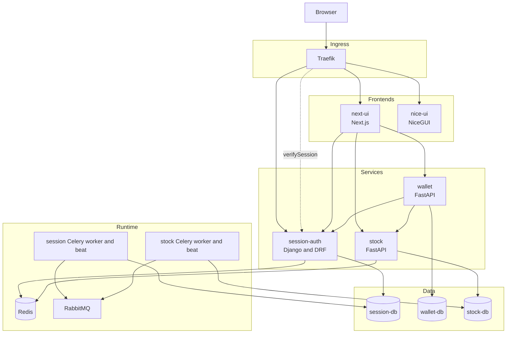
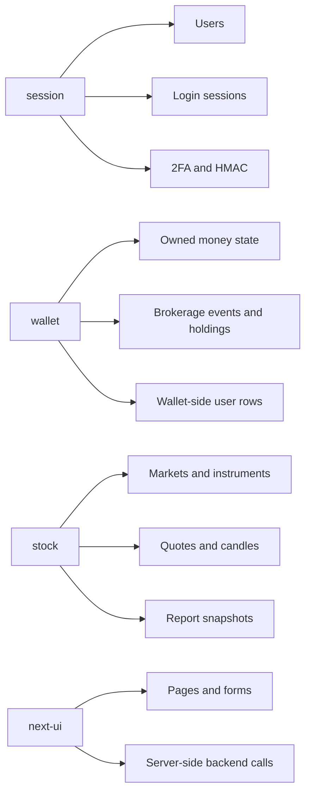

# System Overview

FinancialManager is split into frontend, authentication, financial domain, and market
data services. The split matters when returning to the code: authentication state is
owned by `session`, financial state is owned by `wallet`, and market data plus reports
are owned by `stock`.

## System Topology

## Main Responsibilities

| Component | Responsibility |
|---|---|
| `traefik` | Browser-facing ingress, host/path routing, auth middleware, and auth error routing |
| `next-ui` | Primary Next.js frontend, server actions, dashboard pages, and backend-facing route handlers |
| `nice-ui` | Existing NiceGUI frontend still present in Compose and protected by the same auth service |
| `session-auth` | Django user authentication, registration and activation, sessions, HMAC verification, 2FA, admin auth, cryptographic batch endpoint |
| `wallet` | User financial state: wallets, accounts, cash transactions, brokerage events, holdings, debts, goals, notes, favorites, alerts, real estate, metals |
| `stock` | Market and instrument directory, quotes, candles, market ingestion, report snapshots, report generation, external market-source adapters |
| PostgreSQL databases | One database per backend service boundary |
| Redis | Cache/storage used by `session` security state and by stock runtime locking/cache abstractions |
| RabbitMQ and Celery | Background execution for session jobs/email backend and stock quote ingestion jobs |

## Service Boundaries

The services do not share database tables. They exchange small identifiers and request
data through HTTP. In particular, `wallet` stores financial holdings and its own
instrument reference rows for brokerage state, while `stock` remains the source for
market/instrument lookup, quote data, parsing, and stock reports.

## Infrastructure and External Boundaries

- Local ingress is defined in `docker-compose.yml` and routed through Traefik on the
  `financial_manager` network.
- `session-db`, `wallet-db`, and `stock-db` are separate PostgreSQL containers and
  volumes.
- `Mailpit` is the local SMTP capture surface for session email flows.
- Stock ingestion and report generation cross the system boundary toward configured
  market-data websites and the configured OpenAI report client.
- Developer tools in Compose include Flower, RabbitMQ management, and pgAdmin. They are
  operational helpers, not domain services.

## Architecture Reading Path

1. Read [Service Communication](02-service-communication.md) before changing how browser
   requests reach services.
2. Read [Data Architecture](03-data-architecture.md) before moving data or identifiers
   across service boundaries.
3. Read the relevant service entrypoint under [services](services/) before editing that
   service.
