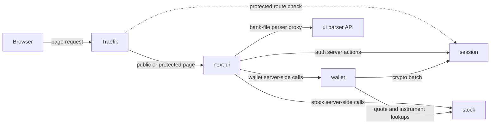
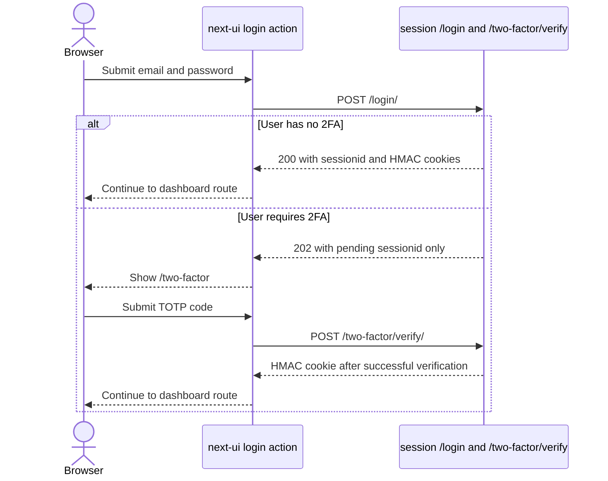
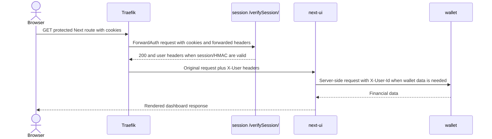

# Service Communication

This document shows how browser requests and backend calls cross service boundaries.
It intentionally stops before detailed endpoint payloads; the current auth contract is
described in [Session Login Security](../design/session-login-security.md), and the
transaction import and mutation contract is described in
[Wallet Transaction Lifecycle](../design/wallet-transaction-lifecycle.md).

## Communication Shape



The browser-facing route owner is Traefik. The application-facing request owner is
usually `next-ui`: server components, server actions, and Next route handlers call the
backend services over internal URLs from environment configuration.

## Traefik Routing

`docker-compose.yml` defines the current browser hosts and protected path behavior.

| Browser host | Main target | Notes |
|---|---|---|
| `next.localhost` | `next-ui` | Primary frontend. The main router uses ForwardAuth. Public auth and framework paths have separate routers. |
| `wallet.localhost` | `nice-ui` | Existing NiceGUI frontend, also protected by ForwardAuth outside public paths. |
| `session-auth.localhost` | `session-auth` | Admin, activation, registration-related and static/media routes exposed for the Django auth service. |
| `flower.localhost` | Flower | Celery monitoring surface in local runtime. |
| `rabbitmq.localhost` | RabbitMQ management | Queue management surface in local runtime. |

For protected Next.js requests Traefik calls:

```text
GET http://session-auth:8000/verifySession/
```

When verification succeeds, Traefik forwards headers from `session` to `next-ui`:

- `X-User`
- `X-First-Name`
- `X-Email`
- `X-User-Id`

At both the current Traefik and Next proxy levels, `/home`, `/login`, `/register`,
`/logout`, and `/two-factor` are outside the protected dashboard route path.
`/home` is the public landing page; the other listed paths are public auth flow routes.
Framework and devtool paths have their own Compose and Next proxy rules.

## Login and 2FA Boundary



`next-ui` renders the login and challenge screens. `session` owns password validation,
Django session state, per-login 2FA verification, TOTP validation, and HMAC cookie
issuance. The current Next login action body contains email and password only. The
Django admin login form still has its separate reCAPTCHA field.

Settings pages use the same split: `next-ui` calls the `session` status, setup, enable,
and disable endpoints; `session` generates the QR image and changes the 2FA state.

## Protected Dashboard Request



If `verifySession` rejects the request, the Traefik error middleware routes the Next.js
request to `/login`. If the authenticated session still needs 2FA, `session` redirects
verification toward the canonical `/two-factor` frontend route.

## Next.js Backend Call Boundaries

`next-ui` has two backend-facing patterns:

1. Server actions for auth and selected form mutations, for example
   `src/features/auth/actions/` and `src/features/wallet/actions/`.
2. Server-side API helpers and route handlers under `src/lib/api/` and `src/app/api/`
   for wallet and stock operations.

The browser should not need direct knowledge of internal service hosts. Protected pages
read ForwardAuth headers via `next/headers`; wallet calls forward `X-User-Id` to wallet
dependencies that enforce the user scope.

## Important Cross-Service Flows

### Wallet user identity handoff

`session` authenticates the Django user. `wallet` keeps its own UUID-backed user row for
financial ownership. When a protected Next page does not already receive `X-User-Id`,
`next-ui` synchronizes the wallet user, stores that wallet UUID back into the Django
session through `/wallet-user-id/`, and later receives it through ForwardAuth headers.

### Wallet to stock lookup

`wallet` uses its `StockClient` for market-facing lookups such as latest quotes,
instrument resolution, and daily candle sync support. This keeps market-data retrieval in
`stock` while wallet calculations and holding state remain in `wallet`.

### Wallet to session crypto batch

`wallet` uses `AuthCryptoClient` to call `session` `/crypto/batch` for user-scoped crypto
operations. The HTTP boundary keeps user key material under `session` ownership.

### Next UI to bank parser API

`next-ui` exposes `/api/wallet/import/parsers` and `/api/wallet/import/parse` as
browser-facing proxy routes. They call the existing `ui` service parser API over
`UI_API_URL`. This is a compatibility boundary during NiceGUI retirement: parsing is not
owned by `wallet`, and the browser does not call the parser service directly.

The proxy validates the selected parser and uploaded file, preserves JSON parser
responses, and replaces HTML or unavailable-service responses with controlled errors.
After preview confirmation, normalized cash rows are sent to `wallet` through
`POST /wallet/transactions/create/rebalance`.

## Related Service Documents

- [Session Service](services/session-service.md)
- [Next UI Service](services/next-ui-service.md)
- [Wallet Service](services/wallet-service.md)
- [Stock Service](services/stock-service.md)
