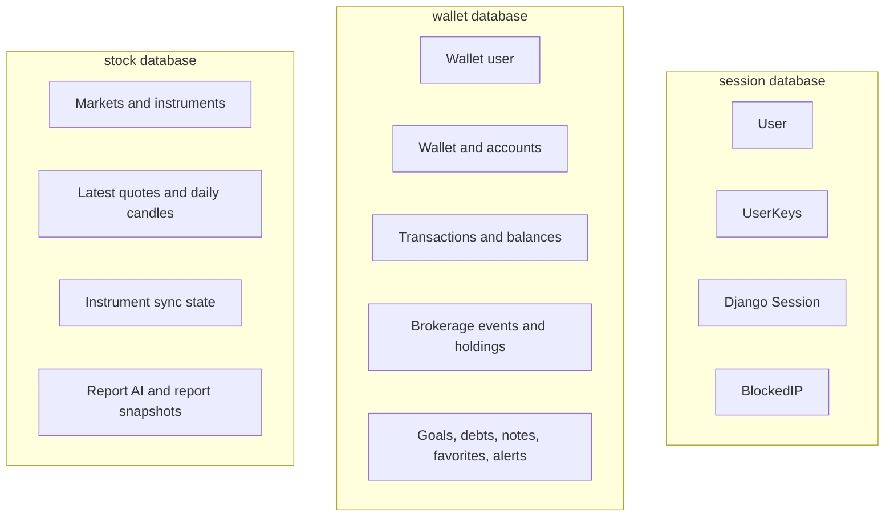
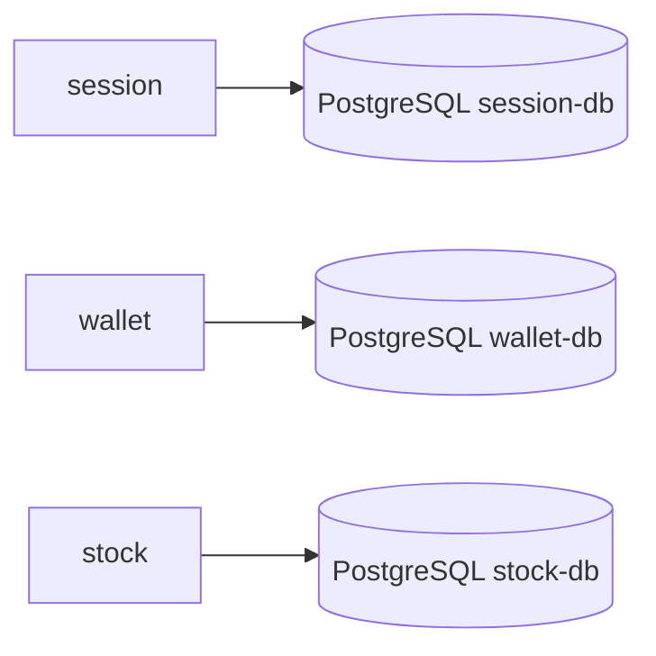
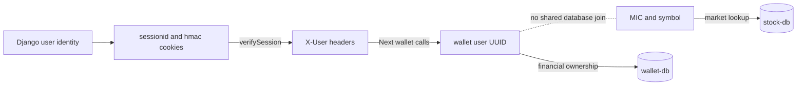
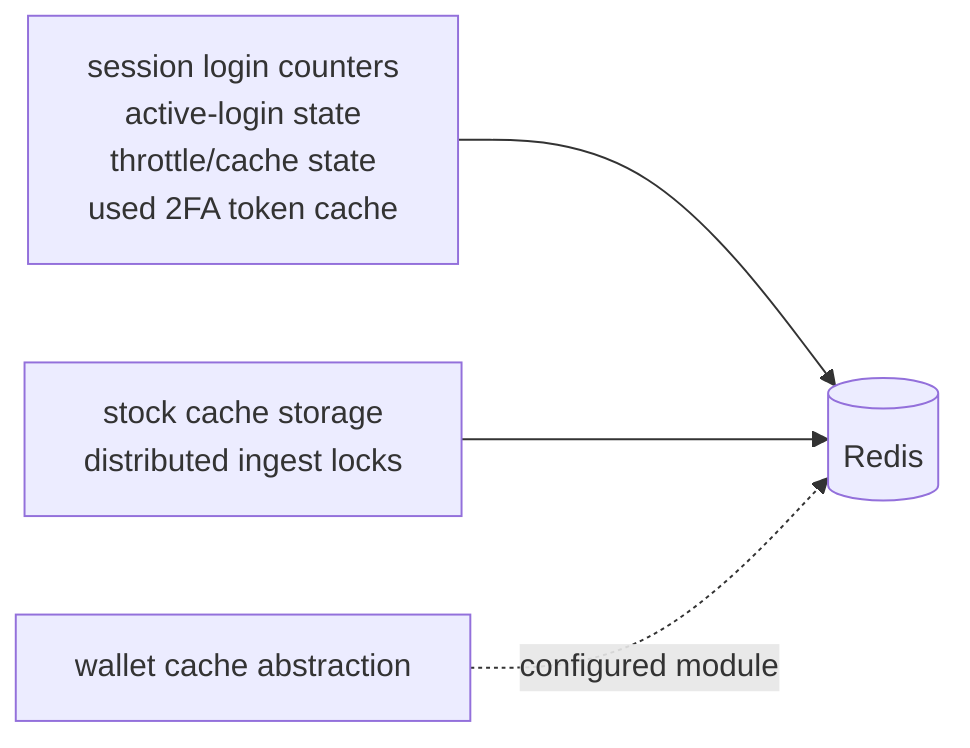

# Data Architecture

Each backend service owns its database boundary. The system favors explicit HTTP handoff
over cross-database joins.

## Ownership Map

| Source of truth | Owned data |
|---|---|
| `session` | Django users, credentials, activation state, 2FA enabled flag, Django sessions, blocked IP rows, user key material |
| `wallet` | Financial ownership and money state for wallets, deposit and brokerage accounts, balances, transactions, brokerage events, holdings, capital gains, real estate, metal holdings, debts, recurring expenses, goals, notes, favorites, alerts |
| `stock` | Market catalog, stock instruments, latest quotes, daily candles, market ingest state, report input/output snapshots |

`wallet` also has wallet-side `Instrument` rows used by brokerage events and holdings.
Those rows are part of financial state. Market discovery, quote reads, parser behavior,
and stock reports stay owned by `stock`.

## Databases

| Service | Migration owner | Code entrypoint |
|---|---|---|
| `session` | Django migrations | `session/userauth/migrations/` |
| `wallet` | Alembic and SQLModel models | `wallet/migrations/`, `wallet/app/models/` |
| `stock` | Alembic and SQLModel models | `stock/migrations/`, `stock/app/models/` |

## Identifiers Across Boundaries

- Browser auth state is represented by `sessionid` and `hmac` cookies issued by
  `session`.
- ForwardAuth adds the user-facing headers used by protected Next pages.
- `X-User-Id` is the wallet service UUID used for wallet ownership checks. It is saved
  in the Django session after Next resolves or creates the wallet-side user row.
- Wallet to stock work is keyed by stock-facing values such as MIC and symbol, not by a
  shared user table.

## Redis and Cache State

`session/config/settings.py` configures Django cache on Redis. Security-oriented cache
state such as login counters, active login records, and 2FA replay markers lives there.
`stock` uses Redis-backed storage and locks around ingest work. `wallet` has Redis/cache
modules and configuration, but its persistent financial state stays in PostgreSQL.

Celery broker and result backend URLs are environment-configured for the backend
services. The local Compose topology provisions RabbitMQ for queue transport and Redis
for cache/result-oriented runtime roles.

## Data Flow Boundaries

| Flow | Boundary |
|---|---|
| Login and 2FA | Next sends auth input to `session`; `session` owns credentials, session state, and cookies |
| Wallet dashboard | Next reads ForwardAuth headers and calls `wallet` with wallet user UUID |
| Brokerage mutation | `wallet` updates holdings, linked cash effects, and gains in its own transaction scope |
| Market read | Next or wallet calls `stock` for quotes, instruments, candles, or reports |
| Crypto batch | Wallet sends user-scoped crypto work to `session` rather than reading key material |

## Storage Reading Path

- Start in `session/userauth/models.py` for auth persistence.
- Start in `wallet/app/models/models.py` for financial persistence.
- Start in `stock/app/models/models.py` for market and report persistence.
- Read [Service Communication](02-service-communication.md) when a change needs to move
  identifiers between services.
