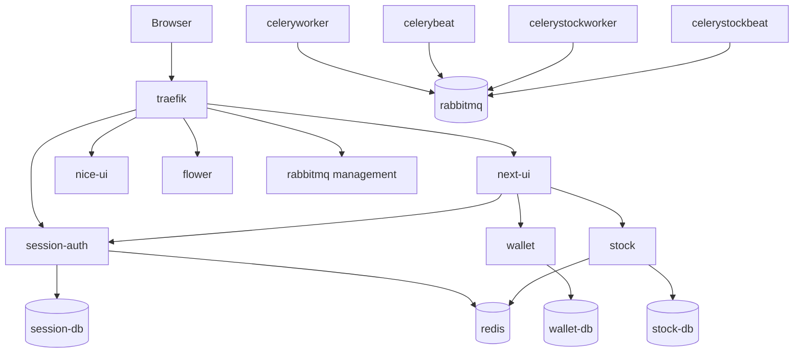
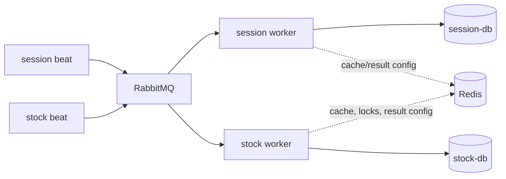
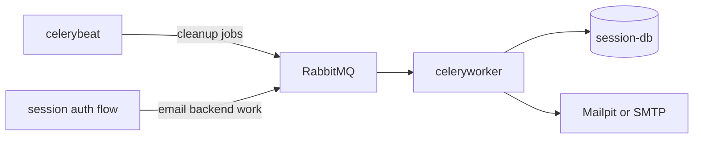
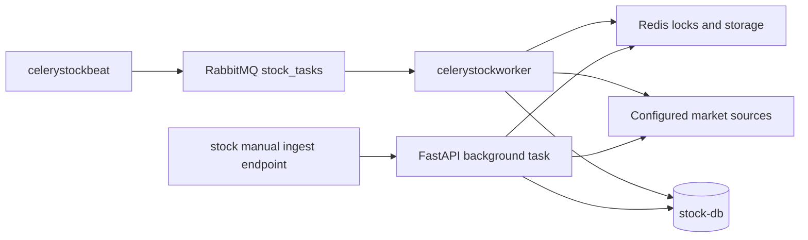

# Runtime and Workers

The local runtime is defined primarily by `docker-compose.yml`. Backend code runs in
service-specific containers, and background work is currently centered on `session` and
`stock`.

## Docker Runtime Topology

| Compose service | Runtime role |
|---|---|
| `traefik` | Reverse proxy and auth middleware entrypoint |
| `session-auth` | Django auth API, admin, session verification, crypto batch |
| `next-ui` | Primary Next.js frontend |
| `nice-ui` | Existing NiceGUI frontend |
| `wallet` | FastAPI financial API |
| `stock` | FastAPI market-data API |
| `session-db`, `wallet-db`, `stock-db` | PostgreSQL storage per backend service |
| `redis` | Shared Redis runtime |
| `rabbitmq` | Celery queue broker surface in local runtime |
| `celeryworker`, `celerybeat` | Session worker and scheduler |
| `celerystockworker`, `celerystockbeat` | Stock worker and scheduler |
| `flower`, `pgadmin`, `mailpit` | Local monitoring, database admin, and email capture |

`wallet/app/core/celery_app.py` exists, but current Compose worker topology does not run
a wallet worker or wallet beat service. Current background-service docs therefore focus
on implemented session and stock processes.

## Queue and Cache Roles

- Celery broker and result backend URLs are configured from service environment
  variables.
- Compose wires `session` and `stock` worker containers to both RabbitMQ and Redis.
- `session` also uses Redis through Django cache for auth-related state.
- `stock` uses Redis storage for ingest locks and cache abstractions around market work.

## Session Runtime Work

`session/config/settings.py` configures a Django Celery beat schedule and
`session/userauth/task.py` defines the project tasks used there.

| Scheduled task | Code name | Intended effect |
|---|---|---|
| Temporary blocked IP cleanup | `userauth.delete_old_temporary_blocked_ips` | Remove old temporary `BlockedIP` rows |
| Inactive user cleanup | `userauth.delete_inactive_users_older_than_3_days` | Delete inactive users older than the activation window |
| Expired session cleanup | `userauth.delete_invalid_sessions` | Delete expired Django session rows |

Session email is configured through `djcelery_email.backends.CeleryEmailBackend`, with
Mailpit as the local SMTP capture service in Compose.

## Stock Runtime Work

`stock/app/core/celery_app.py` configures the `stock_tasks` queue and beat schedule.
Task implementations live in `stock/app/core/tasks/tasks_quotes.py`.

| Beat entry | Task string in beat config | Implemented stock task nearby | Schedule in code |
|---|---|---|---|
| `ingest-gpw-quarter-main` | `ingest_quarter` | Provider-backed task `ingest_gpw_quarter` | Minute 30, hours 9-17, weekdays |
| `ingest-gpw-quarter-alt` | `ingest_gpw_quarter_alt` | HTML-based task `ingest_gpw_quarter_alt` for `XWAR` and `XNCO` | Minutes 0, 15, and 45, hours 9-17, weekdays |

The first row reflects the current code literally: the beat schedule task string and the
provider task name in `tasks_quotes.py` differ. The stock API also exposes Celery status
plus a manual ingest path in `stock/app/api/routes/stock.py`.

Manual ingest currently uses an API-started `asyncio` task with Redis-backed lock and
status keys. It is separate from the scheduled Celery worker path.

## Files to Read First

- `docker-compose.yml` for process topology and Traefik labels.
- `session/config/settings.py` and `session/userauth/task.py` for session scheduling.
- `stock/app/core/celery_app.py` and `stock/app/core/tasks/tasks_quotes.py` for stock
  scheduling and ingest task entrypoints.
- `stock/app/api/routes/stock.py` for manual stock ingest and worker status surfaces.
