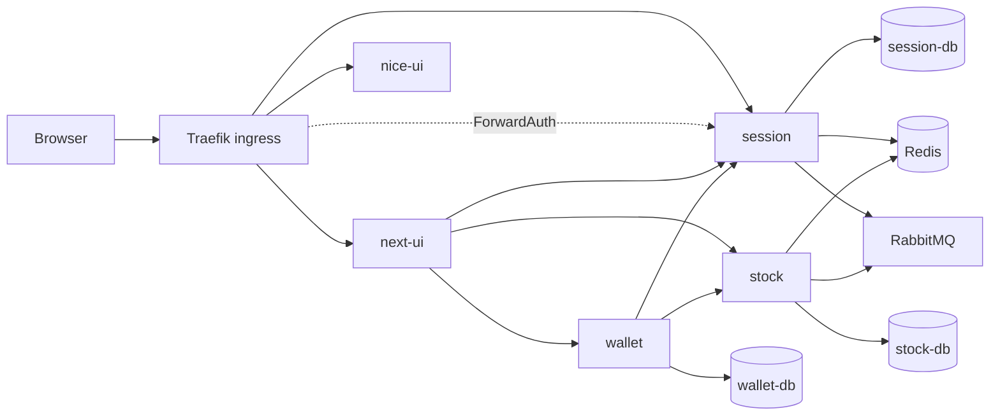

# FinancialManager Architecture

These documents are a code re-entry map for FinancialManager. They describe the system
boundaries, the service owners, the runtime shape, and the flows worth understanding
before changing code.

Start with [System Overview](01-system-overview.md) after a long break. Read
[Service Communication](02-service-communication.md) before changing authentication,
Traefik routing, Next.js backend calls, or cross-service request flow. Open one of the
service documents when the change is local to a service.

## Architecture Map

| Document | Use it for |
|---|---|
| [01 System Overview](01-system-overview.md) | Services, infrastructure, external boundaries, and ownership summary |
| [02 Service Communication](02-service-communication.md) | Browser traffic, Traefik, ForwardAuth, Next.js backend calls, and cross-service flows |
| [03 Data Architecture](03-data-architecture.md) | Data ownership, databases, Redis, shared identifiers, and domain sources of truth |
| [04 Runtime and Workers](04-runtime-and-workers.md) | Docker topology, Celery workers, RabbitMQ, Redis, and real periodic jobs |
| [Session Service](services/session-service.md) | Django auth, sessions, middleware, HMAC verification, admin auth, and 2FA ownership |
| [Next UI Service](services/next-ui-service.md) | App Router layout, auth pages, server actions, route handlers, and protected pages |
| [Wallet Service](services/wallet-service.md) | Financial state, wallet APIs, ownership checks, transactions, holdings, and brokerage flows |
| [Stock Service](services/stock-service.md) | Market data, instruments, quotes, parsers, reports, and stock background ingest |

## Document Layers

Architecture stays at the level of service boundaries, code navigation, and important
request or data flows. Detailed payloads, status code contracts, token state machines,
and auth security edge cases live in detailed design documents.

Current detailed design entrypoints:

- [Session Login Security](../design/session-login-security.md)
- [Wallet Transaction Lifecycle](../design/wallet-transaction-lifecycle.md)
- [Brokerage Holding Events](../design/brokerage-holding-events.md)
- [Brokerage Account Import And Quotes](../design/brokerage-account-import-and-quotes.md)

## System at a Glance

