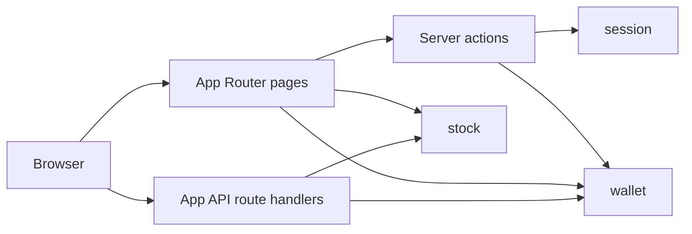
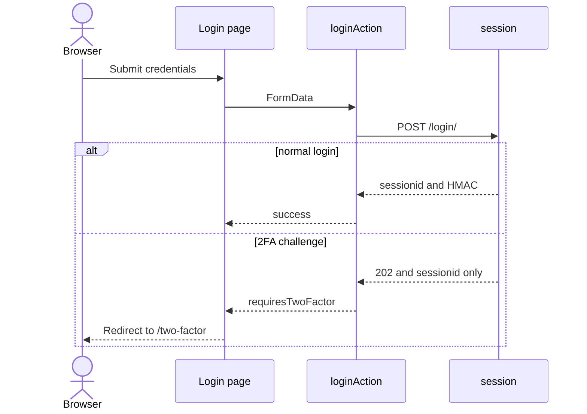
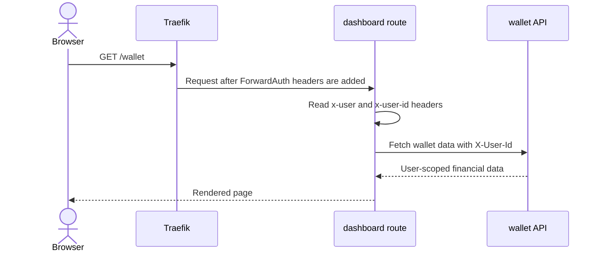

# Next UI Service

## Purpose

`next-ui` is the primary user-facing frontend. It renders public authentication pages
and protected dashboard pages, then acts as the server-side call boundary toward
`session`, `wallet`, and `stock`.

## Responsibilities

- Render public pages such as home, login, register, logout, and the 2FA challenge.
- Render protected dashboard areas for wallets, transactions, brokerage, stock views,
  favorites, reports, and settings.
- Use server actions for auth and selected form workflows.
- Use server-side API helpers and App Router route handlers to call backend APIs.
- Read ForwardAuth headers supplied by Traefik for protected requests.
- Store auth cookies returned by `session` actions and hand auth state back to the
  browser through Next server responses.

## Non-responsibilities

- It does not validate credentials, TOTP codes, HMAC signatures, or session expiry.
- It does not own persistent wallet or stock domain state.
- It does not calculate backend ownership from untrusted browser input; protected pages
  rely on ForwardAuth headers and backend user checks.
- It does not own market ingestion workers or auth cleanup jobs.

## Internal Structure

| Area | Code to inspect | Role |
|---|---|---|
| App routes | `next-ui/src/app/` | Public route groups, dashboard route group, route handlers |
| Auth actions | `next-ui/src/features/auth/actions/` | Login, registration, logout, 2FA calls, cookie handling |
| Auth components | `next-ui/src/features/auth/components/` | Settings-side 2FA UI |
| Wallet UI | `next-ui/src/features/wallet/` | Dashboard components and wallet form actions |
| Reports UI | `next-ui/src/features/reports/` | Stock report presentation |
| Backend helpers | `next-ui/src/lib/api/` | Session, wallet, stock, NBP-facing server helpers |
| Proxy guard | `next-ui/src/proxy.ts` | Public path and trusted host behavior inside Next |

## Entrypoints

Current route families:

- Public auth routes under `src/app/(auth)/`: `/login`, `/register`, `/two-factor`
- Public home under `src/app/(public)/home`
- Dashboard pages under `src/app/(dashboard)/`
- Wallet and stock route handlers under `src/app/api/wallet/` and `src/app/api/stock/`
- Next proxy entrypoint in `src/proxy.ts`

The Compose router for `next.localhost` applies ForwardAuth to the main Next router and
keeps the public auth paths on a separate router.

## Data and Dependencies

- Reads `SESSION_AUTH_URL`, `WALLET_API_URL`, and `STOCK_API_URL` from environment.
- Receives `sessionid` and `hmac` cookies from `session` auth responses.
- Receives `X-User`, `X-First-Name`, `X-Email`, and `X-User-Id` headers from Traefik
  after `session` ForwardAuth success.
- Calls wallet and stock APIs from server-side code; backend services remain data owners.

## Key Flows

### Service boundary map

### Login server action flow

### Protected dashboard request

## Cookie and Identity Handoff

`src/features/auth/actions/auth-cookies.ts` and related auth actions copy the cookies
set by `session` into the Next response. `src/lib/api/session.ts` resolves the wallet
UUID when `X-User-Id` is missing, synchronizes the wallet user, and stores that UUID back
through the session service for later ForwardAuth responses.

## Where to Start Reading

1. `next-ui/src/app/layout.tsx` and route groups under `next-ui/src/app/`.
2. `next-ui/src/proxy.ts` for public path assumptions inside Next.
3. `next-ui/src/features/auth/actions/login.ts` and
   `next-ui/src/features/auth/actions/two-factor.ts` for auth UI boundaries.
4. `next-ui/src/lib/api/session.ts`, `wallet.ts`, and `stock.ts` for backend call
   helpers.
5. The relevant page under `src/app/(dashboard)/` before changing a dashboard workflow.
