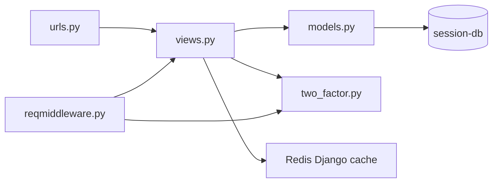
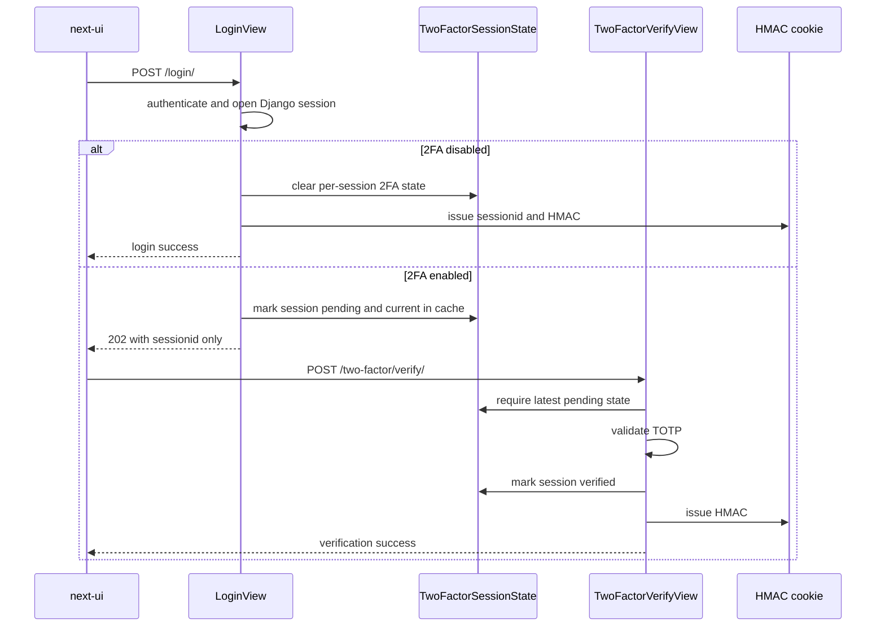
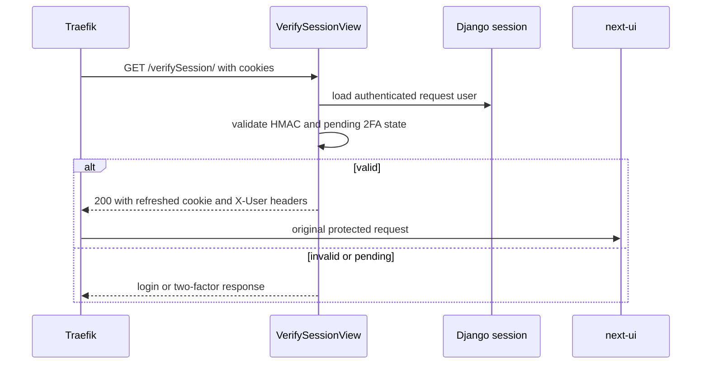

# Session Service

## Purpose

`session` is the authentication and session authority for FinancialManager. It is a
Django and DRF service that owns user credentials, session verification, 2FA state,
security middleware, admin authentication surfaces, and user key material.

## Responsibilities

- Authenticate browser users for Next UI and NiceGUI.
- Register users, send activation flow email, and activate accounts.
- Own Django sessions, HMAC cookies, ForwardAuth verification, logout, and active-login
  cache state.
- Own 2FA setup, enable, disable, login challenge verification, and QR generation.
- Guard requests with middleware checks for blocked IPs, user agent, referer on auth
  routes, authenticated access, and pending 2FA.
- Expose Django admin authentication and admin-oriented QR flow.
- Expose `/crypto/batch` for wallet user-scoped crypto work.

## Non-responsibilities

- It does not render the Next dashboard or own Next UI form state.
- It does not own wallet balances, transactions, holdings, debts, goals, or alerts.
- It does not own market quotes, stock parsers, report snapshots, or stock ingestion.
- It does not make wallet ownership decisions beyond forwarding the wallet UUID stored
  in the Django session.

## Internal Structure

| Area | Code to inspect | Role |
|---|---|---|
| Views and API contract | `session/userauth/views.py`, `session/userauth/urls.py` | Login, logout, verification, 2FA, crypto, wallet UUID handoff |
| Request security | `session/middleware/reqmiddleware.py` | Request checks and pending 2FA redirects |
| 2FA helpers | `session/userauth/two_factor.py` | TOTP secret/QR helpers and per-session 2FA state |
| Auth persistence | `session/userauth/models.py` | User, blocked IP, and user key rows |
| Session settings | `session/config/settings.py` | cookie/cache/Celery/email/auth settings |
| Background jobs | `session/userauth/task.py` | Cleanup jobs used by Celery beat |
| Admin surface | `session/userauth/admin.py`, templates under `session/` | Django admin login and admin 2FA path |

## Entrypoints

Important URL surfaces in `session/userauth/urls.py`:

- `/login/`, `/logout/`, `/register/`, and `/activate/...`
- `/verifySession/` for Traefik ForwardAuth
- `/two-factor/status/`, `/two-factor/setup/`, `/two-factor/enable/`,
  `/two-factor/disable/`, `/two-factor/verify/`
- `/crypto/batch`
- `/wallet-user-id/`
- `/healthz` and `/readyz`

The Django admin host/path routing is declared in Compose through Traefik labels for
`session-auth.localhost`.

## Data and Dependencies

- PostgreSQL `session-db` stores Django user/session tables and auth-owned models.
- Redis-backed Django cache stores security runtime state such as login counters,
  active-login records, current pending 2FA login markers, throttling/cache
  state, and used 2FA token markers.
- RabbitMQ and Celery carry session worker work configured by Django settings.
- Mailpit captures local SMTP traffic.
- Traefik calls `/verifySession/` before protected frontend requests.
- Wallet calls `/crypto/batch` through `AuthCryptoClient`.

## Key Flows

### Internal responsibility map

### Login and 2FA service flow

### Protected route verification

For the detailed auth contract and security edge cases, read
[Session Login Security](../../design/session-login-security.md).

## Where to Start Reading

1. `session/userauth/urls.py` to see the public surface.
2. `session/userauth/views.py` around `LoginView`, `VerifySessionView`, and the 2FA
   views.
3. `session/middleware/reqmiddleware.py` before changing request security behavior.
4. `session/userauth/two_factor.py` before changing login challenge state.
5. `session/config/settings.py` when a change depends on cache, cookies, Celery, email,
   or frontend domain configuration.
