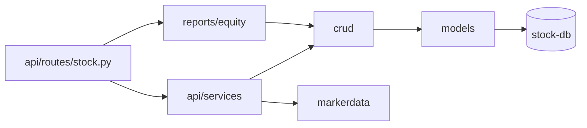
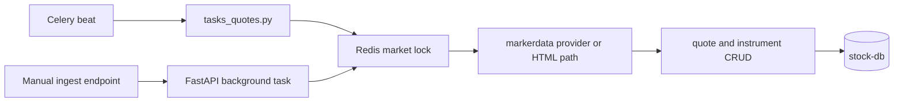
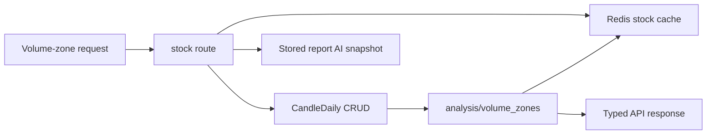
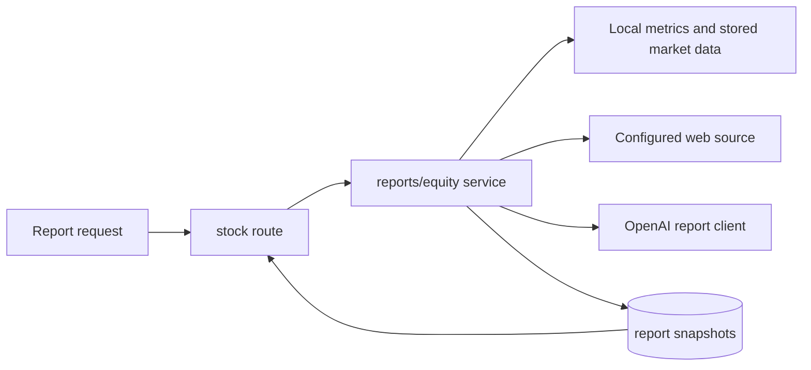

# Stock Service

## Purpose

`stock` is the market-data service. It owns market catalogs, stock instruments, quotes,
candles, parsing and ingestion paths, and stock report generation snapshots.

## Responsibilities

- Own markets, instruments, latest quotes, daily candles, and instrument sync state.
- Expose stock API reads for markets, instrument options/search/resolve, quotes, candles,
  report reads, deterministic volume-zone analysis, and ingest/status operations.
- Parse and ingest market data from configured providers and web sources.
- Allow manual markets and instruments, including optional per-instrument quote source
  URLs for instruments that are not covered by a standard market table ingestor.
- Run scheduled quote ingestion through stock Celery processes and expose a separate
  API-started manual ingest path.
- Build equity report output and store report-related snapshots.
- Provide market-facing lookups used by Next UI and by wallet.

## Non-responsibilities

- It does not own browser authentication or session cookies.
- It does not own wallet holdings, brokerage event history, cash balances, or gains.
- It does not make wallet ownership decisions.
- It does not replace wallet financial instrument references with direct cross-database
  joins.

## Internal Structure

| Area | Code to inspect | Role |
|---|---|---|
| App entrypoint | `stock/app/main.py` | FastAPI app startup |
| Route registry | `stock/app/api/main.py` | Stock route group |
| Stock routes | `stock/app/api/routes/stock.py` | Market, quote, candle, report, worker status and ingest APIs |
| Quote services and tasks | `stock/app/api/services/`, `stock/app/core/tasks/` | Ingest/read orchestration and Celery task entrypoints |
| Market data adapters | `stock/app/markerdata/` | Provider registry, parsers, browser/html integration |
| Reports | `stock/app/reports/equity/` | Report builder, prompt, web source, sanitization, OpenAI client |
| Volume zones | `stock/app/analysis/volume_zones/` | Deterministic OHLCV volume-zone analysis without AI |
| Persistence | `stock/app/models/`, `stock/app/crud/`, `stock/app/db/` | Market/report models and database access |
| Runtime config | `stock/app/core/config.py`, `stock/app/core/celery_app.py` | URLs, report settings, queues, beat schedule |

## Entrypoints

`stock/app/api/main.py` mounts the stock route module under `/stock`.

Important route families in `stock/app/api/routes/stock.py`:

- quotes and bulk latest quotes
- market list and instrument options/search/resolve
- daily candle sync and CSV import
- equity report read
- deterministic volume-zone analysis read
- Celery status and manual ingest status/start

Stock worker entrypoints are:

- `stock/app/core/celery_app.py`
- `stock/app/core/tasks/tasks_quotes.py`

## Data and Dependencies

- PostgreSQL `stock-db` stores markets, instruments, quotes, candles, sync state, and
  report snapshots.
- Redis-backed storage is used by stock cache abstractions and ingest locks.
- RabbitMQ and stock Celery workers carry periodic and manual ingest jobs.
- Configured external boundaries include market-source URLs, report web-source URLs, and
  the configured OpenAI report client.
- Next UI reads stock data and reports; wallet calls stock through `StockClient`.
- `stock` is the source of truth for instrument existence. Wallet may mirror an
  instrument after a successful stock resolve, but missing instruments must be created in
  stock first.

## Key Flows

### Stock module map

### Market data ingestion flow

The scheduled path uses the stock Celery task module. Manual ingest is started by the
stock API and uses storage lock/status keys without entering RabbitMQ first.

### Volume-zone analysis flow

The volume-zone indicator is deterministic and uses daily OHLCV candles available
through the requested date range. It does not call OpenAI or trigger equity report
generation. If a stored report AI snapshot already has free-float and shares-outstanding
metrics, the endpoint uses them as point-in-time turnover context and includes the
snapshot version in the Redis cache key. Historical free-float values are not available in
the stock candle model, so free-float turnover is not treated as historical evidence.
Directional accumulation/distribution phases are anchored to a compact base found before
or early in the evidence signal; confirmation and invalidation dates are returned
separately so historical boxes do not imply the final outcome was known at the base start.
Raw phase candidates are returned for diagnostics. `resolved_directional_episodes` are the
technical merged/conflict-resolved setup layer. `major_directional_phases` are the
after-the-fact historical layer ranked by sign-aware follow-through (`ret20`, `ret60`,
MFE/MAE, expected-direction return, and opposite-move penalty) and are the sparse default
for chart annotation.

### Report read and generation flow

## Where to Start Reading

1. `stock/app/api/routes/stock.py` to see implemented API surfaces.
2. `stock/app/models/models.py` for market and report storage.
3. `stock/app/api/services/quotes.py` and `stock/app/api/services/stock.py` for quote
   read and ingest orchestration.
4. `stock/app/markerdata/` before changing provider or parser behavior.
5. `stock/app/reports/equity/service.py` before changing report generation or report
   snapshots.

For manual instrument administration and quote-source refresh behavior, also read
[Brokerage Account Import And Quotes](../../design/brokerage-account-import-and-quotes.md).
