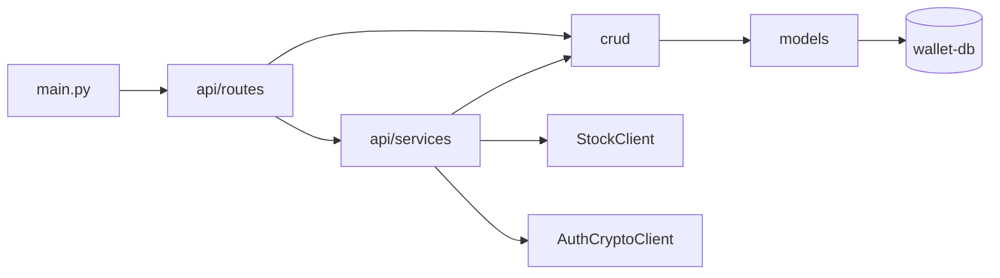
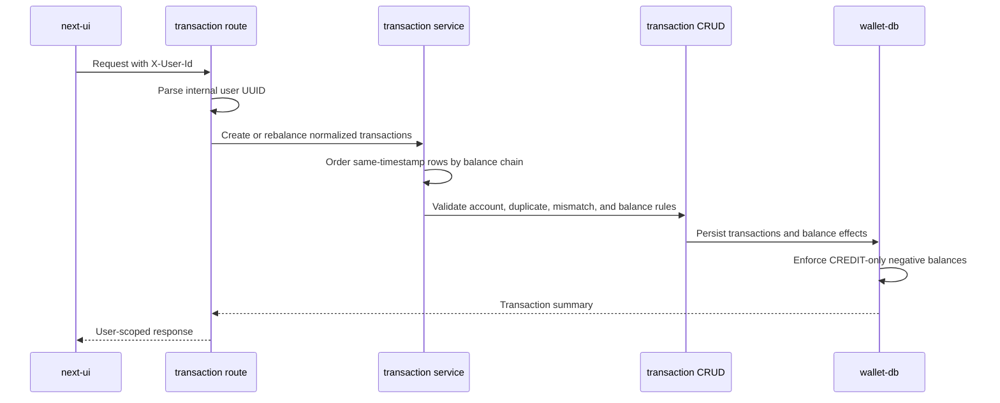
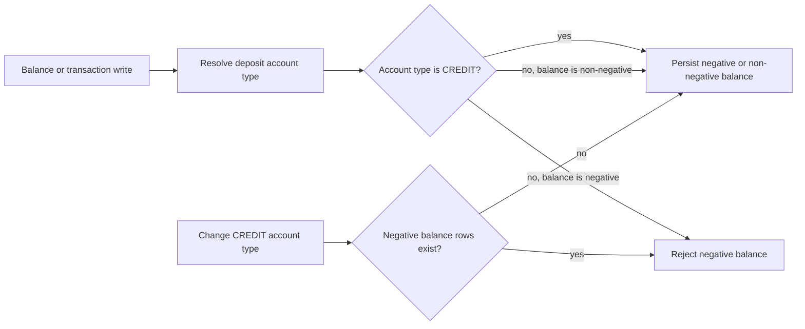
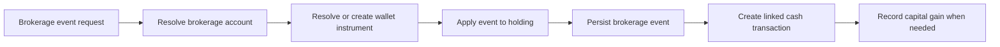

# Wallet Service

## Purpose

`wallet` is the financial domain service. It owns the money state a user changes and
reads from the dashboard: wallets, accounts, balances, transactions, brokerage activity,
holdings, gains, and related personal finance records.

## Responsibilities

- Own wallet-side user rows and all financial ownership checks rooted in wallet UUIDs.
- Manage wallets, deposit accounts, brokerage accounts, balances, and banks.
- Create, list, patch, delete, and rebalance cash transactions.
- Validate imported transaction ordering against the account balance chain before
  persisting cash effects.
- Create and import brokerage events, maintain holdings, record linked cash effects, and
  track realized capital gains.
- Own debts, recurring expenses, goals, notes, favorites, alerts, real estate, real
  estate prices, and metal holdings.
- Call `stock` when wallet work needs market-facing quote or instrument information.
- Call `session` crypto batch operations instead of reading auth key material.

## Non-responsibilities

- It does not authenticate browser sessions or issue auth cookies.
- It does not own password, 2FA, HMAC, or activation state.
- It does not own stock market ingestion, stock reports, or external market-source
  parsers.
- It does not parse uploaded bank files. The current import parser API remains in the
  existing `ui` service and sends normalized rows through `next-ui` to `wallet`.
- It does not store authoritative stock quotes or report snapshots.

## Internal Structure

| Area | Code to inspect | Role |
|---|---|---|
| App entrypoint | `wallet/app/main.py` | FastAPI app startup, DB init, auth and stock clients |
| Route registry | `wallet/app/api/main.py` | Wallet and user route groups |
| Route handlers | `wallet/app/api/routes/` | HTTP surface grouped by domain |
| Services | `wallet/app/api/services/` | Mutation orchestration and financial flows |
| CRUD | `wallet/app/crud/` | Persistence queries and ownership-scoped data access |
| Models and schemas | `wallet/app/models/`, `wallet/app/schemas/` | SQLModel entities and API models |
| Dependencies | `wallet/app/api/deps.py` | `X-User-Id`, auth crypto client, stock client |
| External clients | `wallet/app/clients/` | HTTP calls to `session` and `stock` |

## Entrypoints

`wallet/app/api/main.py` mounts two main route prefixes:

- `/wallet` for wallets, accounts, transactions, brokerage, holdings, real estate,
  metal holdings, debts, recurring expenses, goals, manager views, favorites-related
  wallet flows, and alerts-related wallet flows
- `/users` for user-scoped notes, holdings, favorites, and alerts

The FastAPI health surface is `/healthz`.

## Data and Dependencies

- PostgreSQL `wallet-db` owns financial models.
- Route dependencies parse `X-User-Id` as a UUID and service/CRUD layers keep financial
  queries user-scoped.
- Negative available and transaction balances are allowed only for `CREDIT` deposit
  accounts. PostgreSQL triggers preserve this rule for direct database writes and block
  changing a credit account to another type while negative balances still exist.
- Batch transaction PATCH updates are classification-only: description, category, and
  status can change without rewriting the financial balance chain.
- Transaction import uses `amount_after` as a financial invariant. Same-timestamp rows
  are ordered by balance linkage before create or rebalance processing.
- Dashboard flow aggregation keeps `TAXES` separate from `EXPENSE`; the frontend
  presents taxes as a separate burden when calculating visible profit.
- `StockClient` calls `stock` for quotes, instrument resolution, and candle sync support.
- `AuthCryptoClient` calls `session` `/crypto/batch` for user-scoped crypto operations.
- Wallet has Redis and Celery config modules, but current Compose does not run a wallet
  worker process.

## Key Flows

### Wallet module map

### Transaction mutation flow

### Credit balance database policy

The Alembic migration under `wallet/migrations/versions/` installs cross-table
PostgreSQL triggers because the policy depends on both a balance row and its owning
deposit account type. Downgrade is blocked while negative rows still exist.

### Brokerage and holding flow

`wallet/app/api/services/brokerage_event.py` is the central read for this flow. It shows
how one brokerage event can affect a holding, cash transaction, and realized gain while
remaining inside wallet-owned state.

The detailed transaction rules, parser boundary, API contract, migration policy, and
test expectations are described in
[Wallet Transaction Lifecycle](../../design/wallet-transaction-lifecycle.md).

## Where to Start Reading

1. `wallet/app/api/main.py` to choose the route group.
2. `wallet/app/models/models.py` to understand the financial entity graph.
3. `wallet/app/api/deps.py` before changing identity assumptions.
4. The matching route and service pair under `api/routes/` and `api/services/`.
5. `wallet/app/api/services/brokerage_event.py` and
   `wallet/app/api/services/transactions.py` before changing money mutation flows.
