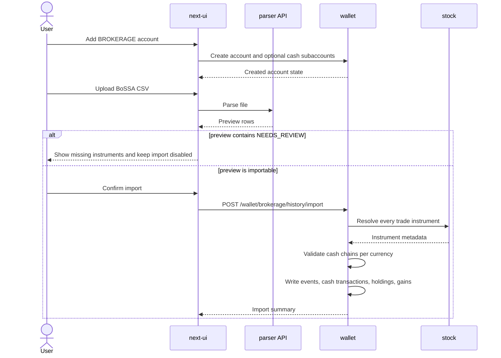

# Brokerage Account Import And Quotes

## Purpose

This design describes the current brokerage account management, brokerage import, and
manual quote-source flow across `next-ui`, `wallet`, `stock`, and the existing parser
boundary. It exists because this area combines financial state, market-data trust, and
multi-currency cash effects.

## Scope

Covered behavior:

- creating brokerage accounts from Next UI
- optional USD and EUR brokerage cash subaccounts
- BoSSA full-history import and broker CSV preview
- stock instrument preflight before wallet writes
- wallet-side instrument mirroring after stock resolve
- manual stock market and instrument creation
- `quote_source` refresh for occasional foreign instruments

Out of scope:

- authentication and HMAC session rules
- periodic market-wide ingestion internals
- full brokerage tax reporting
- automatic creation of stock instruments from uploaded CSV text

## Service Responsibilities

`next-ui` owns the browser workflow:

- renders account creation and brokerage import forms
- sends `BROKERAGE` account creation payloads to wallet
- includes optional USD/EUR brokerage cash account identifiers
- previews parsed brokerage history rows before import
- blocks import when preview rows require manual review
- provides manual market and instrument administration screens

`ui` parser API owns file parsing during the NiceGUI retirement period:

- parses bank and broker files
- normalizes rows for Next UI preview
- marks unresolved BoSSA instrument rows as `NEEDS_REVIEW`
- calculates missing BoSSA `Saldo po operacji` values only when the input can be
  processed as full chronological history

`wallet` owns financial state:

- creates deposit accounts and brokerage accounts
- links brokerage accounts to ordinary deposit-account cash ledgers
- validates cash balance chains per linked cash account and currency
- creates brokerage events, holdings, cash transactions, and capital gains
- calls stock to resolve instruments before creating wallet mirrors

`stock` owns market data:

- stores markets and authoritative stock instruments
- resolves instruments by symbol and MIC, with fallback lookups such as ISIN where
  implemented
- stores latest quotes
- refreshes manually managed instruments that have non-empty `quote_source`

## Business Rules

### Brokerage Account Creation

A brokerage account has a primary PLN cash account. Optional USD and EUR cash accounts
are created or linked as normal wallet deposit accounts. They are not special database
objects and they are included in wallet-manager cash totals.

The account creation payload from Next UI uses this shape:

```json
{
  "walletId": "wallet-uuid",
  "name": "BOSSA IKE",
  "account_type": "BROKERAGE",
  "currency": "PLN",
  "account_number": "BOSSA-IKE-PLN-ARTUR",
  "bank_id": "bank-uuid",
  "brokerage_cash_accounts": [
    {
      "currency": "USD",
      "account_number": "BOSSA-IKE-USD-ARTUR",
      "name": "BOSSA IKE · USD"
    }
  ]
}
```

Technical identifiers are allowed for broker cash subaccounts when the broker does not
provide a separate IBAN. They still need to be unique enough for the user to understand
which broker cash ledger is being linked.

### BoSSA Import Preflight

BoSSA import is all-or-nothing for blocking errors:

- unresolved instruments block import
- missing required cash subaccounts block import
- invalid per-currency balance chains block import
- malformed required fields block import

The parser may still return a preview with `NEEDS_REVIEW` rows. That is not a partial
success; it is evidence shown to the user before they manually add missing instruments in
stock.

Wallet repeats blocking checks before writes. This protects against a manipulated browser
payload that bypasses the disabled import button.

### Instrument Trust

Stock is the source of truth for instruments. Wallet does not create instruments from
raw CSV names or symbols. Before wallet creates a brokerage event or import row, it must
resolve the instrument in stock. Only after a successful resolve may wallet create or
update its local mirror.

This rule prevents accidental holdings such as:

- `PLATIGE-NC` when the stock instrument is `PLATIGE`
- `CFI-FIX` when the canonical symbol is `CFI`
- a foreign ETF name without a known market and source

### Manual Quote Source

Manual instruments may have a nullable `quote_source`, for example:

```text
https://quotes.example.com/q/?s=lnga.uk
```

The URL is a configured quote-page source, not a market-wide feed. Refresh uses the same
browser-capable market-data boundary used by manual ingest when a site requires browser
behavior. Unit tests mock that browser fetcher and must not perform live network calls.

Refresh writes latest quote data when a price is found. If a quote source page cannot be
parsed, the refresh result should expose a controlled per-instrument error without
corrupting other quote updates.

## Main Flow



## Error Handling

User-facing errors should be specific enough to fix data without opening logs:

- missing instrument: row number, normalized symbol, ISIN when available, currency, and
  reason
- invalid balance chain: row number, currency, expected balance, actual balance
- missing cash subaccount: brokerage account, missing currency, and setup action
- oversell: row number, instrument, operation date, sold quantity, owned quantity, and
  missing quantity
- quote-source parse failure: symbol, MIC, and controlled parser error

Backend failures must not be hidden behind generic HTML or service-noise responses in
Next UI routes.

## API Contract

Key wallet endpoints:

```text
POST /wallet/account/create
POST /wallet/brokerage/history/import
POST /wallet/brokerage/event
POST /wallet/brokerage/{brokerage_account_id}/cash-links/ensure
```

Key stock endpoints:

```text
GET /stock/markets?only_with_instruments=true
POST /stock/markets
POST /stock/instruments
GET /stock/instruments/resolve
POST /stock/ingest/quotes
GET /stock/ingest/quotes/status
```

Import preflight failures return `422` and no wallet rows are written. Duplicate rows may
be reported as skipped only after blocking preflight checks have passed.

## Data Model Impact

Wallet:

- brokerage cash links point to regular deposit accounts
- brokerage events remain the audit trail for holdings
- wallet instruments are local mirrors created after stock resolve

Stock:

- `instrument.quote_source` stores an optional quote-page URL
- `instrument.currency` can differ from the market's country or default assumption
- markets can exist because at least one manual instrument belongs to them

## Security Considerations

All wallet mutations are user-scoped. Next UI forwards the authenticated wallet user ID,
and wallet checks ownership of the wallet, brokerage account, and linked cash accounts.

Instrument resolution is a trust boundary. Wallet may not accept arbitrary browser or CSV
instrument text as an owned instrument without stock confirmation.

`quote_source` is user-provided configuration. Refresh should validate supported source
shape and avoid leaking internal parser details to the browser.

## Test Expectations

Evidence expected from the testing process:

- Next UI unit tests for `CreateAccountDialog` validation and account-create payloads
- Next UI unit tests for BoSSA preview blocking, brokerage import errors, and manual
  stock instrument payloads
- wallet unit/component tests for all-or-nothing BoSSA preflight and cash-chain rollback
- wallet unit tests for cash subaccount linking and brokerage account deletion cleanup
- stock unit tests for quote-source parsing and browser fetcher integration without live
  network calls
- stock component/API tests for manual markets, instruments, resolve, and quote refresh
- integration checks for wallet brokerage and stock manual-instrument API paths

