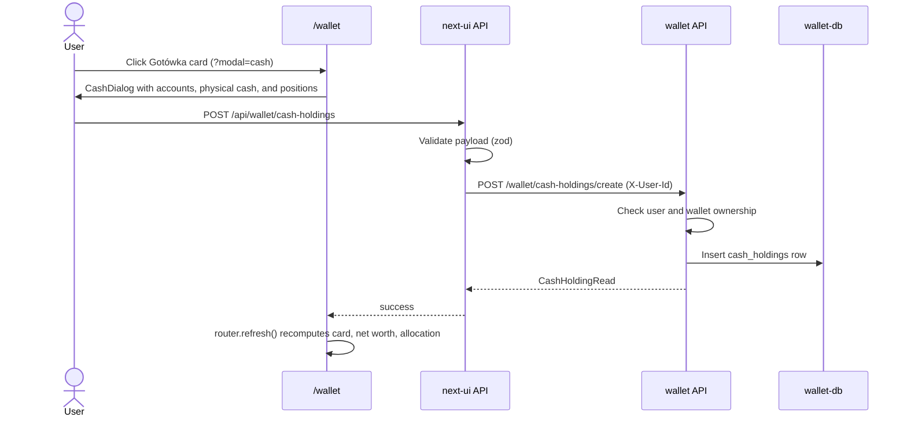

# Wallet Physical Cash

## Purpose

Let a user record physical cash (banknotes in a wallet, a safe, an envelope) as part of
a wallet, so the dashboard `Gotówka` card, net worth, and allocation include money that
is not held on any bank account.

## Scope

- `wallet`: `cash_holdings` table, CRUD endpoints, and `cash_holdings` in the wallet
  list response.
- `next-ui`: proxy routes, the `Gotówka` card that opens `?modal=cash`, and
  `CashDialog` for add, inline edit, and delete.

- `wallet-manager`: physical cash section, wallet total, month-over-month change, and
  monthly snapshot rows.

Out of scope: a deposit/withdrawal history per position.

## Business Rules

- A position belongs to one wallet and has a name, an amount, a currency, and an
  optional note.
- The amount is the current balance entered by the user. It must be `>= 0` and is
  stored with 2 decimals (`Numeric(20, 2)`, half-up rounding in the schema).
- Allowed currencies are `PLN`, `USD`, `EUR`, `GBP`, and `CHF`. The column reuses the
  existing `instrument_currency_enum` type.
- Editing replaces the amount; there is no transaction ledger and no cash transaction
  is created.
- Dashboard values in the view currency use the NBP rates already used by the page:
  - `Gotówka` = deposit account balances + physical cash
  - `Wartość netto` = `Gotówka` + investments - debts
  - `Alokacja portfela` adds each position to its original currency slice
- `Utwórz snapshot` in `/wallet-manager` stores one `cash_holding_monthly_snapshots` row
  per position with the amount in its original currency. Readers convert it with the
  FX table of the same month, like foreign-currency deposit accounts.
- Snapshot totals include physical cash in the dashboard assets chart
  (`assets_8m_total`, `Zmiana m/m`) and in the `wallet-manager` snapshot
  (`cash_physical`) used for the month-over-month badge.
- The `wallet-manager` current wallet total adds physical cash converted with the
  current FX rates. A position without an FX rate is shown with a `missing_fx` health
  chip and counted as 0 rather than at face value.

## Main Flow

## API Contract

| next-ui route | wallet route | Purpose |
|---|---|---|
| `POST /api/wallet/cash-holdings` | `POST /wallet/cash-holdings/create` | Create a position |
| `PUT /api/wallet/cash-holdings/{id}` | `PUT /wallet/cash-holdings/{id}` | Update name, amount, currency, note |
| `DELETE /api/wallet/cash-holdings/{id}` | `DELETE /wallet/cash-holdings/{id}` | Delete a position |
| - | `GET /wallet/{wallet_id}/cash-holdings` | List positions for an owned wallet |

`POST /wallet/sync/user` (wallet list used by the dashboard) adds `cash_holdings: [{id, wallet_id, name, amount, currency, note}]`
to each wallet item. Amounts are decimal strings.

Errors:

- `400`: unknown user.
- `404`: wallet or position missing or owned by another user.
- `422`: invalid payload, including a negative amount or unsupported currency.
- next-ui returns `401` without an authenticated wallet user and `422` before calling
  `wallet` when its own validation fails.

## Data Model Impact

Migration `wallet/migrations/versions/b6d8f0a2c4e6_create_cash_holdings_table.py`
creates `cash_holdings` with `wallet_id` (FK to `wallets`, `ON DELETE CASCADE`),
`ck_cash_holding_amount_nonneg`, and `ck_cash_holding_name_not_empty`. Deleting a
wallet deletes its physical cash positions.

Migration
`wallet/migrations/versions/c8e0a2b4d6f8_create_cash_holding_monthly_snapshots.py`
creates `cash_holding_monthly_snapshots` (`month_key`, `currency`, `value`,
`wallet_id` with `ON DELETE CASCADE`, `cash_holding_id` with `ON DELETE SET NULL`,
unique `(cash_holding_id, month_key)`). Deleting a position keeps its history.
`POST /wallet/manager/snapshots/monthly` returns an additional `cash_upserted` count.

## Security Considerations

- Every endpoint checks that the user exists and owns the wallet of the position.
  Positions of other users return `404` so their existence is not revealed.
- next-ui resolves the wallet user from the authenticated session; the browser never
  sends a user id.

## Test Expectations

Evidence expected from the testing process:

- wallet unit tests for schema rounding, zero and negative amounts, GBP/CHF, ownership
  checks on list/create/update/delete, partial update with note clearing, and the
  migration structure
- wallet unit tests for snapshot upserts in the original currency, snapshot totals with
  FX conversion, and the wallet-manager current value, snapshot value, and missing FX
- integration tests for the `cash_holdings` table, its FK to `wallets`, and the
  non-negative amount constraint on a fresh isolated `wallet-db`
- next-ui unit tests for route validation, auth, error mapping, `CashDialog` add/edit/
  delete/empty/error states, and dashboard conversion of PLN, GBP, and CHF
