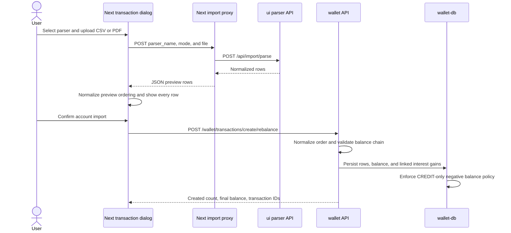
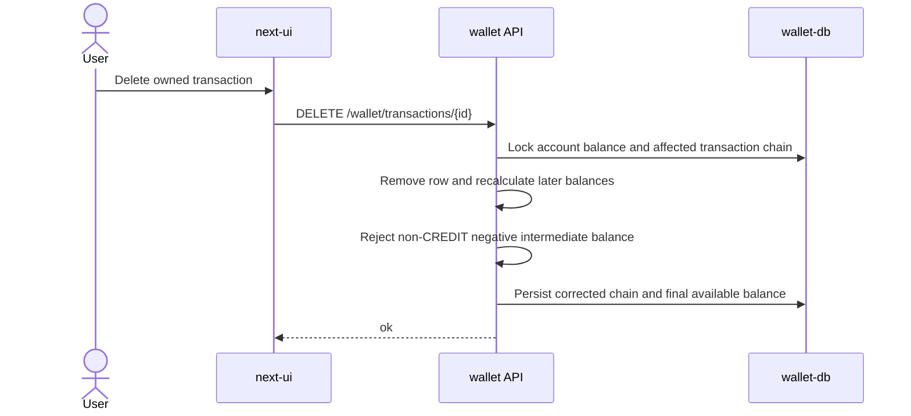
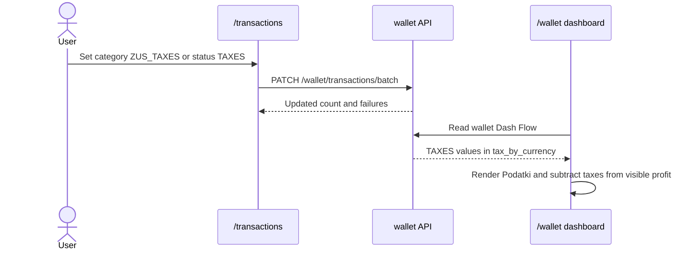

# Wallet Transaction Lifecycle

## Purpose

This document describes the implemented transaction lifecycle used by `next-ui`,
the existing bank parser API in `ui`, and the `wallet` financial domain service. The
design protects cash-balance integrity while supporting manual entry, CSV and PDF
imports, transaction classification, filtering, deletion, and dashboard flow reporting.

## Scope

In scope:

- Manual cash transaction entry from the Next UI wallet dialog.
- Bank-file import preview and confirmation from the same dialog.
- ING CSV, mBank CSV, and Velo Bank PDF parser behavior.
- `wallet` create, list, classification patch, delete, and rebalance endpoints.
- Same-timestamp transaction ordering from reported post-transaction balances.
- Credit-account negative balance policy and its database migration.
- Transaction category and status metadata used by `/transactions`.
- `TAXES` handling in wallet Dash Flow.

Out of scope:

- Brokerage event import details beyond linked cash transaction behavior.
- Stock market parsers and report generation.
- A redesign of the legacy `ui` parser service. It remains a compatibility dependency
  while NiceGUI is being retired.

## Ownership Boundaries

| Area | Owner | Notes |
|---|---|---|
| Import interaction and preview | `next-ui` | Keeps the selected file, parser selection, preview, and confirmation state |
| CSV and PDF parsing | `ui` | Exposes parser metadata and normalized rows through `/api/import/*` |
| Financial validation and persistence | `wallet` | Owns transactions, account balances, capital gains, filtering, and rebalance |
| Browser session verification | `session` and Traefik | Protects `/wallet`, `/transactions`, and Next API routes before wallet calls |
| Credit-only negative balance enforcement | `wallet-db` | PostgreSQL triggers protect direct database writes as a final integrity layer |

## Business Rules

### Balance chain

Each persisted cash transaction belongs to one deposit account and satisfies:

```text
balance_after = balance_before + amount
```

Create and delete operations preserve this chain. Imported rows can provide
`amount_after`; when present, `wallet` validates it against the calculated result.
A mismatch returns a controlled validation error instead of persisting a partial chain.

### Import ordering

Bank exports are not assumed to have one universal row order.

- Ascending rows remain chronological.
- Descending rows are processed oldest-first.
- Mixed rows receive a stable timestamp sort.
- Rows sharing one timestamp are ordered by balance linkage:
  `row.balance_before = previous_row.balance_after`.
- The opening balance from the last row of the previous date group anchors the start
  node search for the next date group. This resolves ambiguity in same-timestamp groups
  whose before-values form a closed loop with no natural root.
- When more than one valid chain path exists within a same-timestamp group, the source
  order breaks the tie. Ascending imports prefer top-to-bottom source order; descending
  imports prefer bottom-to-top source order inside the group.
- The algorithm backtracks when balance values repeat within a same-timestamp group,
  trying every possible start node until a complete chain covering all rows is found.
- A same-timestamp group with any missing `amount_after` value keeps its source order
  without attempting balance-chain reordering.

The Next UI applies the equivalent normalization when showing the preview, and `wallet`
repeats validation before persistence. Preview behavior is helpful feedback, but backend
validation remains authoritative.

### Negative balances

Negative cash balances represent credit debt and are allowed only for deposit accounts
with `account_type = CREDIT`.

- `CURRENT` and `SAVINGS` accounts reject a create, rebalance, or delete result that
  makes any processed balance negative.
- `CREDIT` accounts can store negative `available`, `balance_before`, and
  `balance_after` values.
- PostgreSQL triggers enforce the same rule for direct writes.
- An account cannot change from `CREDIT` to another type while negative balance rows
  exist.
- Migration downgrade fails clearly until negative rows are resolved, because the old
  global non-negative constraints cannot be restored safely otherwise.

### Classification

Category and status are classification metadata edited from `/transactions`.

- Create/import establishes financial rows first.
- `PATCH /wallet/transactions/batch` can update only `description`, `category`, and
  `status`.
- `category` and `status` can be cleared with `null`.
- Amount, `balance_before`, and `balance_after` are read-only in the batch PATCH
  contract. Financial corrections must use lifecycle operations that rebalance the
  chain.
- `ZUS_TAXES` is presented as the `ZUS i podatki` category.
- `TAXES` is presented as the `Podatki` status.

### Capital gains from imported interest

The parser marks interest rows with `capital_gain_kind = DEPOSIT_INTEREST`. When
`wallet` persists a non-zero row with that kind, it creates the linked capital-gain
record. Capital gain recognition is driven by the normalized row metadata rather than
the deposit account type.

ING savings statements can contain one incoming row whose title includes a principal
transfer and a net interest amount. The ING CSV parser splits that row into:

1. A principal row without the interest marker and with an intermediate balance.
2. An interest row with `DEPOSIT_INTEREST` and the statement's final balance.

This prevents the complete transfer amount from being classified as interest.

### Dashboard flow

Wallet Dash Flow aggregates monthly values by currency:

- `INCOME`
- `EXPENSE`
- `TAXES`
- capital gains

`TAXES` is a separate burden, not an expense bucket. The Next UI renders a dedicated
`Podatki` series and subtracts its absolute value when calculating visible profit.
The YTD expense tile keeps its existing source aggregation but displays the absolute
value.

## Main Flows

### Import and persist



Changing the bank-format selector resets parsed preview results but intentionally keeps
the selected file. The workflow works in either order: choose file first or choose
parser first.

### Delete and rebalance



### Classify and report taxes



## Parser Behavior

### ING CSV

`ui/imports/csv/parser.py`:

- Detects quoted and encoding-damaged header variants used by Polish bank exports.
- Uses transaction date first, then operation date, then booking date as fallback.
- Joins non-empty counterparty and title values without failing on missing fields.
- Marks ordinary interest descriptions as `DEPOSIT_INTEREST`.
- Splits combined principal-plus-interest incoming rows into two linked rows.

### Velo Bank PDF

`ui/imports/pdf/parser.py`:

- Reads every PDF page with Tabula.
- Normalizes tables independently because headers may repeat or disappear on later
  pages.
- Uses booking date when available, with transaction date as fallback.
- Collapses wrapped descriptions and recovers description text that overflows into the
  amount cell.
- Ignores non-transaction rows that do not contain both amount and resulting balance.
- Marks interest descriptions as `DEPOSIT_INTEREST`.

### mBank CSV

`ui/imports/csv/parser.py`:

- Reads `Data księgowania` as the transaction date; skips rows with no parsable date.
- Parses amounts and resulting balances from Polish locale format (comma decimal
  separator, space thousands separator).
- Joins `Opis operacji` and `Tytuł` columns into a single description string.
- Does not perform interest splitting; mBank statements do not combine
  principal-plus-interest in a single row.

Tests use synthetic fixture PDFs and CSVs. Real statement files containing private
financial data must not be committed.

## API Contract

### Next UI boundary

| Method and path | Behavior |
|---|---|
| `GET /api/wallet/import/parsers` | Proxy parser metadata from `ui`; reject HTML/service noise |
| `POST /api/wallet/import/parse` | Require `parser_name` and uploaded file; proxy normalized rows |
| `POST /api/wallet/transactions` | Validate manual/import rows and forward rebalance create |
| `GET /api/wallet/transactions` | Forward pagination, account, category, status, date, and search filters |
| `PATCH /api/wallet/transactions` | Accept strict classification-only batch updates |
| `DELETE /api/wallet/transactions/{id}` | Delete one owned transaction |

### Wallet boundary

| Method and path | Behavior |
|---|---|
| `POST /wallet/transactions/create/rebalance` | Manual or import create; resolves account ownership, normalizes row order, verifies balance chain, returns summary and transaction IDs |
| `GET /wallet/transactions` | Return user-scoped paginated rows, filters, search, and `sum_by_ccy` |
| `PATCH /wallet/transactions/batch` | Update owned description/category/status fields only |
| `DELETE /wallet/transactions/{id}` | Delete an owned row and rebalance the later chain |

`/create/rebalance` is the single public cash-transaction create endpoint. It resolves
ownership through the account and returns transaction IDs for downstream delete flows.
Brokerage flows reuse wallet transaction services internally rather than exposing a
second HTTP create contract.

Important wallet errors:

- `400`: unknown user or a delete operation rejected by lifecycle validation.
- `404`: unknown account or transaction not owned by the current user.
- `409`: duplicate transaction.
- `422`: malformed input, balance mismatch, or a non-credit negative balance result.

`next-ui` resolves the wallet UUID from the authenticated session and forwards
`X-User-Id`; wallet queries remain user-scoped.

## Data Model Impact

The Alembic migration
`wallet/migrations/versions/d4f61a2b9c7e_allow_negative_credit_balances.py` replaces
global non-negative check constraints with account-type-aware PostgreSQL triggers:

| Trigger | Protected rule |
|---|---|
| `trg_depaccbal_available_credit_only` | Negative `available` is allowed only for `CREDIT` |
| `trg_tx_balances_credit_only` | Negative transaction chain fields are allowed only for `CREDIT` |
| `trg_depacc_account_type_credit_only` | A credit account with negative rows cannot be changed to another type |

Each Alembic `op.execute()` sends one top-level SQL command. This is required by the
asyncpg prepared-statement path used during wallet container startup.

## Security Considerations

- `/wallet`, `/transactions`, and Next wallet API routes are protected through Traefik
  ForwardAuth. Successful `verifySession` refreshes the HMAC window before a protected
  request reaches `next-ui`.
- Next API handlers resolve the wallet-side UUID from authenticated session state.
- Wallet create, list, patch, and delete operations are ownership-scoped.
- Parser proxy routes do not expose raw HTML error bodies from upstream routing or
  service failures.
- Statement fixtures must contain synthetic data only.
- Database triggers protect financial integrity even when a future code path bypasses
  normal wallet services.

## Error Handling

- Parser errors are shown as controlled import errors and do not submit partial rows.
- A mismatched `amount_after` identifies the transaction date and expected balance.
- Missing Velo amount/balance cells are ignored as statement noise.
- Duplicate rows are checked before collision-safe timestamp allocation and rejected
  rather than silently inserted.
- Failed lifecycle operations run inside a database transaction and do not leave a
  partially updated chain.

## Test Expectations

Evidence expected from the testing process:

- Wallet unit tests for ascending, descending, mixed, same-day, and same-timestamp
  ordering; optional values; rounding; capital-gain metadata; and negative-balance
  account rules.
- Parser component tests for ING CSV header variants, missing values, combined
  principal-plus-interest rows, mBank CSV date and Polish-locale number parsing,
  Velo multi-page PDFs, repeated or missing headers, wrapped descriptions, skipped
  non-transaction rows, and interest metadata.
- Wallet component tests for create/rebalance, duplicate and mismatch failures,
  pagination, filters, search, `sum_by_ccy`, classification-only PATCH, null clearing,
  cross-user behavior, deletion rebalance, taxes, and dashboard flow.
- Integration tests for CREDIT negative balances, CURRENT/SAVINGS rejection, account
  type-change rejection, downgrade preflight, and migration execution on a fresh
  isolated `wallet-db`.
- Next UI unit tests for MSW-backed API clients and routes, parser proxy errors, file
  retention after parser selection, complete preview rendering, ordering, filtering,
  sorting, pagination, classification editing, and Dash Flow calculations.
- Robot functional evidence for authenticated transaction lifecycle behavior through
  the Next UI.

## Code Reading Path

1. `next-ui/src/features/wallet/components/TransactionsDialog.tsx`
2. `next-ui/src/features/wallet/components/TransactionsPage.tsx`
3. `next-ui/src/app/api/wallet/transactions/route.ts`
4. `next-ui/src/app/api/wallet/import/`
5. `ui/imports/csv/parser.py` and `ui/imports/pdf/parser.py`
6. `wallet/app/api/routes/transaction.py`
7. `wallet/app/api/services/transactions.py`
8. `wallet/app/crud/transaction_crud.py`
9. `wallet/migrations/versions/d4f61a2b9c7e_allow_negative_credit_balances.py`
